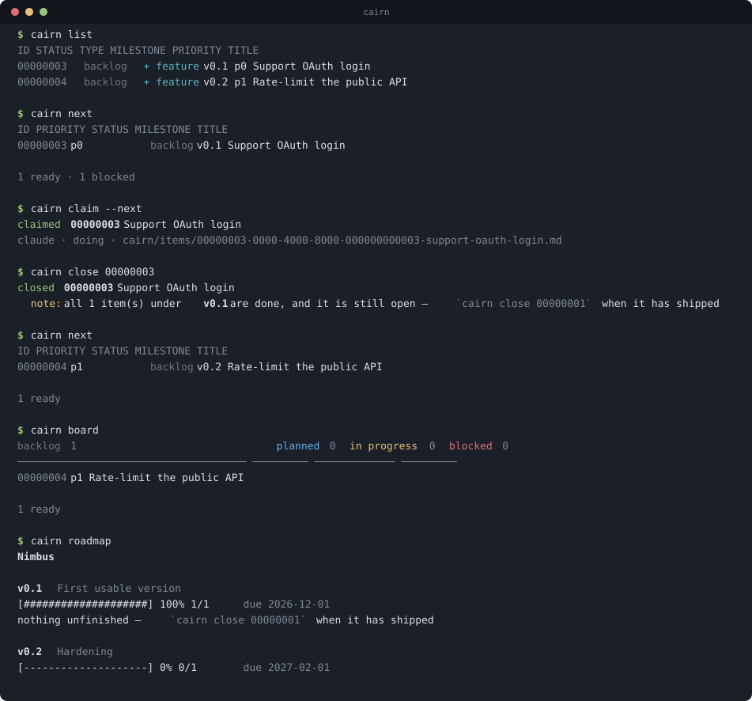

# cairn

A roadmap and issue manager that lives in your repository, as Markdown, under a
schema you define.

A cairn is a stack of stones marking a trail. This one marks yours: every item
is a plain `.md` file with YAML frontmatter, versioned alongside the code,
reviewable in a pull request, and greppable with the tools you already have.
`cairn.toml` describes the item types, statuses, fields, milestones and views
your project actually uses — the CLI enforces that schema, so the structure
holds up whether a human, a script or a coding agent is doing the writing.



<sup>Recorded by `make demo`, which runs those commands for real and renders
their actual output — so the picture cannot drift from the program.</sup>

Note the third command. `0002` depends on `0001`, so it stays off the list until
`0001` closes: `cairn next` shows work that is genuinely startable, not
everything that is open.

## Why

Roadmaps rot because they live somewhere the work does not. A `ROADMAP.md`
edited by hand drifts from reality within a month. An issue tracker on another
website is invisible from the terminal, unavailable offline, and impossible to
review alongside the diff that closes it. And coding agents, left to themselves,
strew `TODO.md`, `PLAN.md` and `NOTES-final-v2.md` across the tree, each in a
format of its own invention.

cairn takes the position that project state is source, and that the fix for
freeform Markdown is not less Markdown but a schema:

- **The repository is the database.** No server, no account, no network. Items
  merge, branch and revert like everything else you version.
- **The schema is yours.** `cairn.toml` is the whole configuration surface.
  Rename the statuses, add the fields, define the views. Nothing is hardcoded.
- **The roadmap is generated.** `cairn render` builds `ROADMAP.md` from the
  items, and `cairn render --check` fails CI when the committed file has drifted.
- **Agents get a contract.** `cairn agent` emits an instruction block, generated
  from your live schema, that tells a coding agent exactly which commands and
  fields to use. It cannot describe a workflow you do not have.

## Install

```sh
cargo install cairn-md                  # installs a binary named `cairn`
git clone … && cargo install --path .   # from source
curl -fsSL https://…/install.sh | sh    # prebuilt binary, no Rust toolchain
```

The package is `cairn-md` because `cairn` is taken on crates.io by an unrelated
crate; the binary it installs is `cairn`.

Optional, and worth doing:

```sh
cairn completions zsh > ~/.zfunc/_cairn        # also bash, fish, elvish, powershell
cairn man --dir /usr/local/share/man/man1
make install                                   # binary, man pages, and the Info manual
```

The full manual is Texinfo — `info cairn` after `make install-info`, or
`make html` for a browsable copy. `README.md` is the tour; the manual is the
reference.

## Quickstart

```sh
cairn init                                    # writes cairn.toml + cairn/items/
cairn new "Support OAuth login" \
    --type feature --milestone v0.1 --set priority=p0 --label auth
cairn set 1 status=doing
cairn board
cairn render                                  # regenerates ROADMAP.md
cairn check                                   # validates everything
```

`cairn init --preset minimal` starts from three statuses and nothing else;
`--preset standard` (the default) writes a fully commented schema to cut down.

## An item

```markdown
---
id: 1
title: Support OAuth login
type: feature
status: doing
milestone: v0.1
labels:
  - auth
  - backend
depends_on:
  - 3
created: 2026-09-04
updated: 2026-09-11
priority: p0
---

## Problem

Password auth is the only option, and enterprise users keep asking for SSO.

## Acceptance criteria

- [ ] Authorization code flow with PKCE
- [ ] Refresh tokens survive a restart
```

Everything above `---` is schema-checked. Everything below is yours. Edit the
file in your editor, or from the CLI — either way the other one keeps working.
`cairn edit 1` opens `$EDITOR` and re-validates on the way out; a title change
renames the file to match.

## Configuring the schema

`cairn.toml` is the only configuration. A sketch:

```toml
[project]
name = "cairn"
dir = "cairn/items"       # where item files live
id_width = 4              # 0001, 0002, …
default_status = "backlog"

[[type]]
name = "bug"
icon = "!"
color = "red"
template = """           # seeds the body of every new bug
## What happens

## Reproduction
"""

[[status]]
name = "doing"
label = "in progress"
category = "active"       # open | active | done | dropped
color = "yellow"

[[field]]
name = "priority"
kind = "enum"             # enum | text | list | date | number | bool
values = ["p0", "p1", "p2", "p3"]
default = "p2"
column = true             # show it in `cairn list`

[[milestone]]
name = "v0.1"
title = "Usable in anger"
due = "2026-10-15"

[[view]]
name = "triage"
filter = "milestone=,category!=done"
columns = ["id", "type", "title", "created"]

[render]
target = "ROADMAP.md"
group_by = "milestone"
include = "category!=dropped"
```

Status **order** is meaningful — it is the column order on the board and the
sort order in listings. Status **category** is what the tool reasons about, so
you can call your statuses `icebox` and `shipping` and progress bars, default
filters and checkbox rendering all keep working.

Run `cairn config` to see the resolved schema, or `cairn config --json` to feed
it to something else.

## Finding things

Every listing command takes the same filter grammar. Clauses are ANDed with
commas, alternatives are separated by `|`, and an empty value means *unset*:

```sh
cairn list --status doing                    # convenience flags
cairn list --type bug --label auth
cairn list --filter 'priority=p0|p1,category!=done'
cairn list --filter 'milestone='             # not scheduled yet
cairn list --filter 'labels~auth'            # substring / list membership
cairn list --filter 'updated<2026-06-01'     # lexical and numeric comparison
cairn list --view triage                     # saved in cairn.toml
cairn list --sort '-priority,updated'
```

Operators: `=` `!=` `~` `!~` `>` `>=` `<` `<=`. Alongside your own fields,
`category` resolves through the status table.

For scripting, `--json`, `--ids`, `--count` and `--plain` (tab-separated, no
colour) are all available:

```sh
cairn list --ids --filter 'priority=p0' | xargs -n1 cairn show
```

## The generated roadmap

```console
$ cairn roadmap --items
cairn
A markdown-native roadmap and issue manager that lives in your repository.

v0.1  Usable in anger
  [--------------------]   0%  0/2   due 2026-10-15
  Enough to run a real project's roadmap without reaching for anything else.
    0001  in progress   Publish to crates.io and Homebrew
    0002  planned       Ship shell completions and a man page

$ cairn render
wrote ROADMAP.md  7 items
```

`ROADMAP.md` is a build artefact: sections per milestone, progress bars,
checkboxes, and whatever header and footer Markdown you point `render.header`
and `render.footer` at. Never edit it by hand — change the items and re-render.

## Hooks

cairn does not embed a scripting language. It runs yours.

```toml
[hooks]
after-create = "cairn render -q"
after-change = "cairn render -q"
after-render = "git add ROADMAP.md"
```

A hook runs from the project root with the event in the environment
(`CAIRN_EVENT`, `CAIRN_ITEM_ID`, `CAIRN_ITEM_STATUS`, `CAIRN_ITEM_PATH`, and the
rest) and the complete item as JSON on stdin. It takes one of two forms:

```toml
# A string runs through the platform shell — convenient, and therefore
# platform-specific: $VAR on a Unix shell is %VAR% under cmd.exe.
after-change = "jq -r 'select(.category==\"done\") | .title' | xargs -r notify-send"

# An array is executed directly, with no shell at all — portable.
after-change = ["python3", "scripts/notify.py"]
```

Use the array form in any project that has to run on more than one platform;
the script it names can be written in whatever language you like, and the shell
never gets a chance to disagree about quoting.

Hooks run *after* the change is on disk, which fixes the contract: a failing
hook warns and nothing is rolled back, the same as git's `post-` hooks.
`--no-hooks` and `CAIRN_NO_HOOKS=1` suppress them; the latter is set inside the
hook's own environment, so a hook can call `cairn` without recursing.

This is the extension point, and deliberately a Unix one rather than an
embedded interpreter. Replacing cairn's *own* behaviour — a different renderer,
a custom validator, new subcommands — needs more than that; it's on the roadmap
as `0008`, with the tradeoffs written down.

## Identifiers, and the one sharp edge

Ids are small integers because people have to type them. That has a cost worth
stating plainly: allocating "the next" id requires knowing every id in use,
which requires coordination, which a distributed workflow does not provide. Two
contributors on two branches each create the next item and both get `0008`. The
branches merge cleanly — the filenames differ — and you have two items sharing
an id.

`cairn check` detects it and names both files. `cairn renumber` repairs it:

```console
$ cairn renumber --dry-run
  0008 -> 0009  Branch B feature
$ cairn renumber
renumbered: 1 item(s)
```

The older item keeps the contested id and the one that arrived later moves, so
the repair matches what happened. Because nothing can unambiguously *refer* to
a duplicated id, existing `depends_on` references are left pointing at the
retained item and cairn says so rather than guessing. `--compact` renumbers
everything into a gapless sequence and rewrites references as it goes; it
refuses to run while duplicates exist, since the references would then be a
guess.

Renumbering is never automatic. It rewrites files, and that should happen
because you asked.

## Agents working the backlog

This is what cairn is for. An agent dropped into the repo needs to answer three
questions — what should I work on, is anyone else on it, and where do I record
what I found — and `cairn` answers all three without it having to invent a
format.

### Over MCP (best)

```sh
cairn mcp --config      # prints the snippet for .mcp.json, .cursor/mcp.json, …
```

`cairn mcp` serves the backlog over the Model Context Protocol on stdio: ten
tools covering `get_schema`, `next_items`, `search_items`, `show_item`,
`claim_item`, `create_item`, `update_item`, `close_item` and `check`. Tools beat
instructions because they cannot be forgotten halfway through a task, and a
rejected write comes back as something the model can act on:

```
update_item {"id": 1, "fields": {"status": "nope"}}
→ isError: unknown status `nope`
  known: backlog, planned, doing, blocked, done, dropped
```

Every item that crosses the boundary carries `blocked`, `ready` and `blockers`,
because dependency state is the thing an agent most needs and cannot work out
from a single item.

### Over the CLI

```sh
cairn agent --write AGENTS.md    # or CLAUDE.md — generated from your live schema
```

The block it writes describes the loop, the real statuses and fields, and the
filter grammar, between `<!-- cairn:begin -->` markers so re-running updates it
in place. The loop itself:

```console
$ cairn next
ID    STATUS       MILESTONE  BLOCKED BY  TITLE
0001  in progress  v0.1                   Publish to crates.io and Homebrew
0003  backlog      v0.2       0010        Import issues from GitHub   ← hidden by default

$ cairn claim --next
claimed 0001  Publish to crates.io and Homebrew
  claude · doing · cairn/items/0001-publish-to-crates-io-and-homebrew.md
```

`cairn next` ranks what is actually startable — nothing blocked by an unfinished
dependency, work already in progress first — and `cairn claim` writes the
assignment into the item so a second worker gets told:

```console
$ cairn claim 1
cairn: 0001 is already claimed by claude
use --force to take it anyway
```

That is the whole coordination mechanism: no lock server, no daemon. Two agents
on two branches merge like any other file, and `cairn check` catches whatever
the merge could not.

Identity comes from `CAIRN_USER`, falling back to `git config user.name`, so an
agent can name itself without touching your git config.

### Searching

```sh
cairn search oauth                          # titles, bodies and labels
cairn list --filter 'blocked=false,priority=p0'
cairn list --filter 'body~"acceptance criteria"'
```

Alongside your own fields, the filter grammar exposes `category`, `blocked`,
`ready`, `blockers` and `body`.

## Moving a backlog in and out

cairn speaks one documented interchange format, and every integration is an
adapter over it — so a tracker cairn has never heard of is one `jq` script away.

```sh
cairn import --from github --repo owner/name    # through `gh`, using your existing auth
cairn import --from json backlog.json --dry-run
cairn export --to json --output backlog.json
```

The hard part of import is that the incoming vocabulary is not yours: a GitHub
issue is `open` or `closed`, while your project might call those `icebox` and
`shipped`. Matching by name fails, so cairn maps by **category** — the one axis
that means the same thing in every cairn project — and `--map` handles the rest:

```console
$ cairn import --from json export.json --create-milestones --map type:chore=task
warning: `Record a terminal demo`: field `effort` is not declared in cairn.toml — dropped
imported: 13 created, 0 updated, 0 already present
```

Anything it cannot place is reported rather than silently dropped. Every
imported item records where it came from in a `source` field, so running the
same import twice updates instead of duplicating:

```console
$ cairn import --from json export.json
imported: 0 created, 0 updated, 13 already present
```

GitHub is read through the `gh` CLI rather than an HTTP client: no token
handling inside cairn, no second place for credentials to live, and enterprise
hosts work because you already configured them.

## In CI## Moving a backlog in and out

cairn speaks one documented interchange format, and every integration is an
adapter over it — so a tracker cairn has never heard of is one `jq` script away.

```sh
cairn import --from github --repo owner/name    # through `gh`, using your existing auth
cairn import --from json backlog.json --dry-run
cairn export --to json --output backlog.json
```

The hard part of import is that the incoming vocabulary is not yours: a GitHub
issue is `open` or `closed`, while your project might call those `icebox` and
`shipped`. Matching by name fails, so cairn maps by **category** — the one axis
that means the same thing in every cairn project — and `--map` handles the rest:

```console
$ cairn import --from json export.json --create-milestones --map type:chore=task
warning: `Record a terminal demo`: field `effort` is not declared in cairn.toml — dropped
imported: 13 created, 0 updated, 0 already present
```

Anything it cannot place is reported rather than silently dropped. Every
imported item records where it came from in a `source` field, so running the
same import twice updates instead of duplicating:

```console
$ cairn import --from json export.json
imported: 0 created, 0 updated, 13 already present
```

GitHub is read through the `gh` CLI rather than an HTTP client: no token
handling inside cairn, no second place for credentials to live, and enterprise
hosts work because you already configured them.

## In CI

```yaml
- run: cairn check --render --strict
```

`check` validates every item against the schema: unknown statuses, types and
milestones, missing required fields, bad enum values and dates, dangling and
circular dependencies, duplicate ids. With `--render` it also proves the
committed `ROADMAP.md` matches the items. It exits non-zero on errors, and with
`--strict` on warnings too.

## Commands

| Command | What it does |
| --- | --- |
| `cairn init` | Write `cairn.toml` and the item directory |
| `cairn new` (`add`) | Create an item |
| `cairn list` (`ls`) | Query items — filters, views, JSON |
| `cairn next` | What is ready to work on, ranked |
| `cairn search` (`grep`) | Full-text over titles, bodies and labels |
| `cairn claim` / `release` | Take or hand back an item |
| `cairn show` | One item in full |
| `cairn set` | Change fields: `status=doing`, `labels+=auth`, `assignee=` |
| `cairn close` / `reopen` | Move between open and done statuses |
| `cairn edit` | Open in `$EDITOR`, re-validate afterwards |
| `cairn remove` (`rm`) | Delete items |
| `cairn board` | Kanban board on stdout |
| `cairn roadmap` | Milestones with progress |
| `cairn render` | Generate the roadmap file |
| `cairn export` / `import` | Move a backlog in or out |
| `cairn check` | Validate against the schema |
| `cairn renumber` | Repair duplicate ids, rewriting references |
| `cairn milestone` | List, add, edit and remove milestones |
| `cairn config` | Show the resolved schema |
| `cairn agent` | Instruction block for coding agents |
| `cairn mcp` | Serve the backlog to agents over MCP |
| `cairn completions` / `man` | Shell completions and the man page |

`cairn --help` and `cairn <command> --help` have the details, and `info cairn`
has all of it. `-C DIR` runs as if started elsewhere; `--color` takes `auto`,
`always` or `never`, and `NO_COLOR` is honoured; `--no-hooks` disables hooks.

## Durability

The repository is the database, so the write path is the part that has to be
boring and correct.

**Writes are atomic.** Every file cairn writes — items, `ROADMAP.md`,
`cairn.toml`, exports — goes to a temporary file beside the target, is flushed
to the device, and is then renamed over it. A crash, a full disk or a killed
process leaves either the old file or the new one, never a half-written mixture.
There is a test that kills cairn mid-write forty times and checks the item is
still intact.

**Line endings are preserved.** A CRLF item file is written back as CRLF, so a
checkout with `core.autocrlf` set does not turn every `cairn set` into a
whole-file diff. New items are LF, and `cairn init` ships a `.gitattributes`
pinning the item directory to `eol=lf` so a repository has one answer regardless
of client configuration.

**One broken file does not stop everything.** `list`, `next`, `board`, `search`
and `roadmap` report the file they could not read and carry on with the rest —
a backlog should not become unlistable because something left a file mid-write.
Anything that *writes*, and anything that produces a durable artefact
(`check`, `render`, `export`, `set`, `renumber`), refuses instead: acting on a
partial view of the backlog is how data gets lost.

**Concurrent writers are serialised.** Allocating an id means reading the
highest one in use and adding one, which is only correct while nothing else is
doing the same. Mutating commands take a lock file in the item directory for the
duration of the write; reads never take it, so listing a backlog never queues
behind somebody's write. A lock left behind by a process that died is broken
after five minutes, with a warning. Forty concurrent `cairn new` calls produce
forty distinct ids, and twelve agents racing for one item produce exactly one
holder — both are tests.

The lock is released *before* hooks run, because a hook may itself call cairn and
the write is already durable by then. There is a test for that ordering too.

**An interrupted `renumber` recovers itself.** Renumbering moves a file aside
before writing it back; if that is interrupted, the next command restores it and
says so.

The frontmatter parser is the trust boundary for three kinds of input — typed,
model-written, and imported — so it is property-tested: anything cairn writes it
reads back unchanged, rendering twice is byte-identical, and arbitrary bytes may
be rejected but never panic.

## Platforms

A tier is a promise about what CI does, not a sentiment.

| Tier | Platforms | What that means |
| --- | --- | --- |
| **1** | Linux `x86_64`, `aarch64` (musl, static) | The reference platform. Full test suite plus a musl build and test on every change; release binaries; where behaviour is *defined* when platforms disagree. |
| **2** | macOS `aarch64` / `x86_64`, Windows `x86_64` | Full test suite on every change; release binaries. Supported — a failure here is a bug, not a caveat. |
| **3** | Everything else Rust targets | Builds from source. No CI, no binaries, best effort. |

The whole end-to-end suite runs on every Tier 1 and Tier 2 platform. It drives
the real binary from Rust rather than a shell, precisely so that "works on
Windows" is something CI checks rather than something the README claims.

Two things are genuinely platform-shaped, and both are documented where they
bite: hook strings go through the platform shell (use the array form to avoid
it), and `filename_max` defaults to the POSIX 255 bytes.

## Prior art

cairn is not the only tool in this space, and it is not always the right one.

- [**git-bug**](https://github.com/git-bug/git-bug) stores issues as native git
  objects rather than files in the worktree, and bridges to GitHub and GitLab.
  Reach for it when you want issues that push and pull like branches, and do not
  need a planning layer.
- [**Backlog.md**](https://github.com/MrLesk/Backlog.md) is Markdown-native too,
  with a web UI and an MCP server, and is a fine choice if you want a board more
  than a schema.
- [**todo.txt**](https://github.com/todotxt/todo.txt-cli) and
  [**dstask**](https://github.com/naggie/dstask) are lighter, task-shaped, and
  excellent when a roadmap is not what you are after.

cairn's particular bet is the configurable schema and the generated roadmap: the
structure is declared in one file, enforced by `check`, and rendered into
something contributors can read.

## The repository

Laid out the way a GNU project is, so the files are where you expect:

| | |
| --- | --- |
| `COPYING` | The GNU General Public License, version 3 |
| `AUTHORS` | Who has contributed |
| `NEWS` | User-visible changes, newest first |
| `README.md` | This tour |
| `doc/cairn.texi` | The manual — `info cairn`, or `make html` |
| `CONTRIBUTING.md` | How to get started; the backlog is the guide |
| `SECURITY.md` | How to report a vulnerability |
| `cairn/items/` | The project's own roadmap, in cairn |
| `ROADMAP.md` | Generated from it by `cairn render` |

## Contributing

```sh
cargo test          # unit and end-to-end tests, on any platform
make check          # the above plus fmt, clippy, and cairn's own roadmap
make doc            # build the Info manual (needs texinfo)
```

cairn tracks its own roadmap in `cairn/items/`, so `cairn next` is the
contribution guide: it shows what is ready to work on, and each item carries the
reasoning that produced it. See [CONTRIBUTING.md](CONTRIBUTING.md).

## License

GNU General Public License v3.0 or later. See [COPYING](COPYING).
